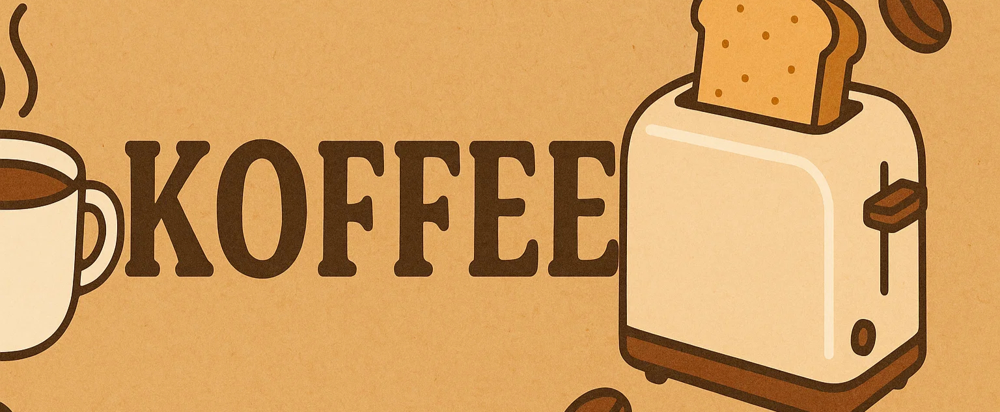
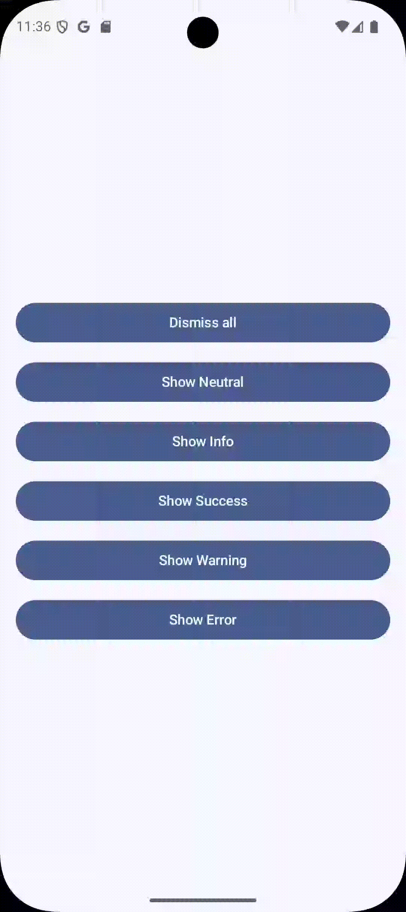

<!-- Banner -->  
<p align="center">
  
</p>
  
[](https://jitpack.io/#donald-okara/Koffee)


<h1 align="center">☕ Koffee</h1>  

<p align="center">  
  A lightweight, animated toast system for Jetpack Compose.    
  Serve your toasts hot, cold, or custom brewed.  
</p>  

> 🙌 Want to contribute? Check out our [Contribution Guidelines](CONTRIBUTIONS.md).
---  

## ✨ Features

- 🍞 Simple toast host & state management
- 🪄 Animated entrance/exit with layout awareness
- 🧊 Supports multiple types of toasts: Info, Success, Error, etc.
- 🧩 Plug-and-play composables for custom toast UIs
- 🔧 Customizable positioning, dismissal, durations
- 🪶 Lightweight with zero dependencies

---  

## 📱 Demo

This is a demo of how Koffee works. The toasts are swipeable.

<p align="center">
  
</p>


---
## 🛠 Installation

Add the dependency from jitpack.io

```kotlin
// settings.gradle.kts
dependencyResolutionManagement {
    repositoriesMode.set(RepositoriesMode.FAIL_ON_PROJECT_REPOS)
    repositories {
        google()
        mavenCentral()
        maven(url = "https://jitpack.io") // 👈 Add this
    }
}


```

```kotlin

// module build.gradle.kts
dependencies {  
    implementation("com.github.donald-okara:koffee:<latest version>") // Replace with latest tag
}  
```  
  
---  
## 🧱 Architecture

Koffee has 3 layers:
1. **Koffee.init** – Configure default behavior.
2. **Koffee.Setup** – Renders and animates toast layouts.
3. **Koffee.show** – Triggers new toasts globally.

You can plug in your own toast layouts, define duration policies, and limit how many are shown at once.

---
## 🚀 Getting Started

### Step 1: Initialize Koffee

> This goes in your application class or MainActivity onCreate

```kotlin  
override fun onCreate() {  
    super.onCreate()  
  
    Koffee.init {  
        layout { DefaultToast(it) } // or custom. DefaultToast() is our in built default toast composable 
        dismissible(true)  
        durationResolver { customDurationResolver(it) }  
    }
}

private fun customDurationResolver(duration: ToastDuration): Long? = when (duration) {  
    ToastDuration.Short -> 5000L  
    ToastDuration.Medium -> 7000L  
    ToastDuration.Long -> 10000L  
    ToastDuration.Indefinite -> null  
}
```  

> Hint: You can use Koffee.init{} with an empty lambda as there are default values for everything
### Step 2: Add Koffee.setup

> This goes in your root composable

```kotlin  
Scaffold(modifier = Modifier.fillMaxSize()) { innerPadding ->  
    Box(  
        contentAlignment = Alignment.Center,  
        modifier = Modifier.padding(innerPadding),  
    ) {  
        // 1. Your app UI  
        TestToasts()  
  
        // 2. Render Koffee  
        Koffee.Setup(  
            maxVisibleToasts = 2,  
        )  
    }  
}
```  

### Step 3: Show toast

> You can call Koffee.show from anywhere as long as the dependency was installed.

```kotlin
Button(  
    onClick = {  
        Koffee.show(  
            title = "Success toast",  
            description = "This is a green notification",  
            type = ToastType.Success,  
            primaryAction = ToastAction("Share", { println("Viewing info details") }),  
            secondaryAction = ToastAction("Copy", { println("Copied!") }),  
        )  
    },  
    modifier = Modifier.fillMaxWidth(),  
) {  
    Text("Show Success")  
}
```
---  

## 🔧 Customization

You can pass your own Composable to style the toast as long as its signature matches

```kotlin  
@Composable (ToastData) -> Unit
```  


---  

## 📦 License

```  
MIT License  
```  
  
---  

## 🙏 Credits

Built with love for Jetpack Compose devs who want more control over their UI.    
Made by [@donald-okara](https://github.com/donald-okara)

> Looking for feature X? [Open an issue](https://github.com/donald-okara/koffee/issues)

## 📜 License

Koffee is licensed under the [Apache License 2.0](https://www.apache.org/licenses/LICENSE-2.0). You’re free to use, modify, and distribute it under the conditions specified.


🧾 Full documentation available at 👉 [https://donald-okara.github.io/koffee/](https://donald-okara.github.io/koffee/)

